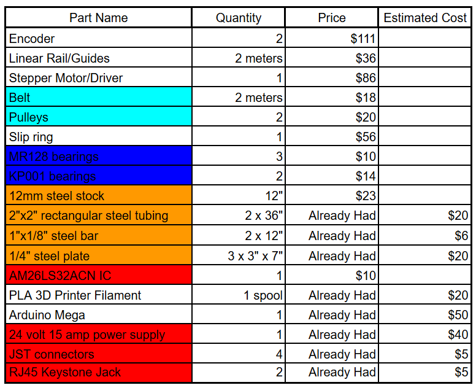

## Design

All parts designed for the pendulum were first modeled in SolidWorks and put in an assembly to assure accurate design. Purchased parts were either modeled as well or models were found online to be included in the assembly.

The project budget was roughly $500. Including estimated raw materials, the total bill of materials is shown here. The total amount we spent was just under $400, and the estimated total including parts we had was roughly $550.

> **Note:** All CAD files were created with a student license of SolidWorks.
