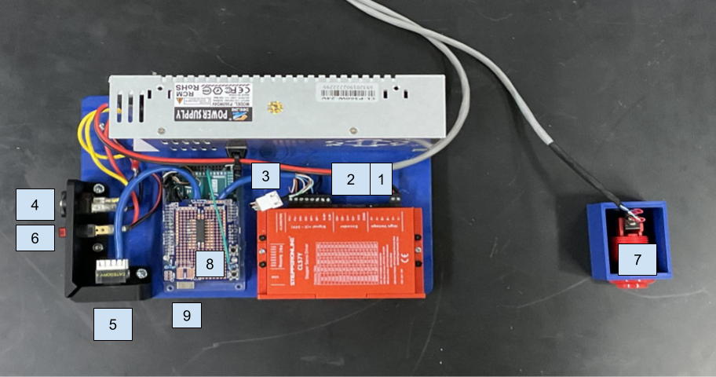

## Steps for Simple Operation

### Setup:
1. Plug in Stepper Motor and Stepper Encoder cables (Encoder has two plugs, one to Stepper Driver and one for Arduino)  
2. Plug in a Cat6 (Ethernet) cable to the Control and Power Unit and the Pendulum Cart  
3. Plug in a C13 cable into the Control and Power Unit  
4. Ensure Emergency Stop Button is plugged into GND and pin 52 (unplugged will cause fault)  
5. Power Arduino using USB-B cable or compatible barrel plug  

### Operation:
1. Place the cart in the center (line up the two black lines on the front)  
2. Let the pendulum arm hang down freely  
3. Flip on Power Switch on Control and Power Unit  
4. Once red light on Arduino turns off, flip pendulum arm vertical  
5. Once arm is 180 degrees from its hanging position, the balancing control will activate  

### On Fault:  
(*If angle > 15 degrees, position exceeds safe limits, or Emergency Stop Button is pressed*)  
1. Cart will return to center automatically  
2. Let the pendulum arm hang down freely  
3. Once red light on Arduino turns off, flip pendulum arm vertical  
4. Once arm is 180 degrees from its hanging position, the balancing control will activate  

### Important Locations:
1. Motor connector  
2. Motor Encoder connector (only for Stepper Driver)  
3. Motor Encoder connector #2 (connects to Arduino)  
4. C14 connector (receiver for C13 cable)  
5. Ethernet port for communication with pendulum  
6. Main Power Switch  
7. Emergency Kill Button  
8. Red LED on Arduino  
9. USB-B for reprogramming  
