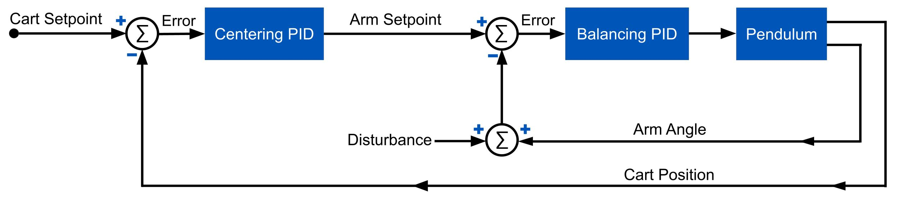

## Project Overview

The main constraint of this project was to build the inverted pendulum system at a total cost of $500, while creating a robust system that will continue to be used for future control system classes and research. After calculating system accuracy requirements, mechanical and electrical components were found to match the specifications. A full CAD (Computer Aided Design) assembly was modeled using Solidworks (Figure 2) and engineering drawings created for individual parts. The subsections of the system are the steel base, linear guide system, motor and belt drive, pendulum arms and pivots, and electronics and sensors. After procuring materials and components, the individual components were manufactured using 3D printing, machining, and welding. The final design allows for the system to be used as a single and double inverted pendulum.

### Youtube Video of working single inverted pendulum

## Control System

A framework for an Arduino based PID controller was developed using ChatGPT, with separate PIDs for each controlled motion. PID controller outputs, encoder angles and time were collected to create graphs for tuning purposes. The encoders are calibrated by aligning the arms in a vertical position with the Arduino reading and storing the position. Safety limits are programmed that if a cart position or angle threshold is exceeded, the motor is disabled.

## PID Tuning

The controller that balances the first beam was tuned using Ziegler Nichols method. This was done by increasing the proportional constant until the system reached continuous oscillation, with the period of oscillation and required proportional constant then used to calculate values for P, I and D. In order to tune the PID controller that centers the cart, the graphs of system and controller data were analyzed to determine values for P, I and D. The proportional constant was increased until the system responded quickly to error. The derivative constant was added to remove overshoot, and a small amount of integral was added to reduce steady state error.

